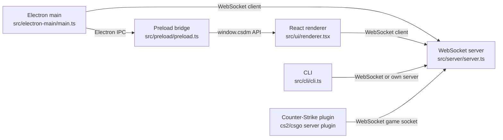
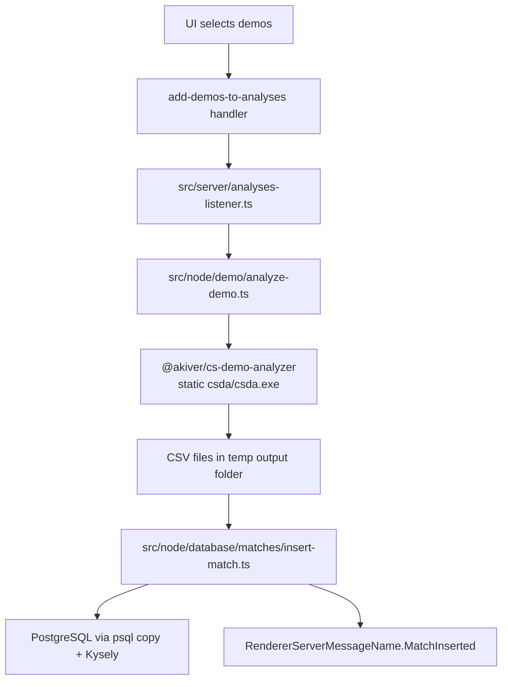

# Codex Repo Notes

These notes are for long-term customization work on the personal fork
`Heaven-Karas-One/cs-demo-manager`, whose upstream is `akiver/cs-demo-manager`.

## Current Local State

- Working branch observed: `dev`.
- Configured remote observed: `origin` -> `https://github.com/Heaven-Karas-One/cs-demo-manager.git`.
- Upstream remote should be added before the first sync from the source repo:
  `git remote add upstream https://github.com/akiver/cs-demo-manager.git`.
- Existing working tree noise observed in server plugin dependency folders/submodules. Treat those as pre-existing user
  state unless a task explicitly targets server-plugin dependencies.

## Command Rules

- Use `vp`, not `pnpm`, for dependency management, scripts, linting, formatting, and tests.
- Common checks:
  - `vp check`
  - `vp run test`
  - `vp run deadcode`
  - `vp run i18n:extract` after user-visible UI or Electron-main strings change.
- Tests import from `vite-plus/test`, not directly from `vitest`.

## Process Architecture

Server is the hub. Heavy work should usually live in `src/server/` or `src/node/`. The renderer should request work
through typed WebSocket messages. Electron IPC/preload is for OS-level concerns such as windows, dialogs, file paths,
clipboard, startup behavior, and local filesystem helpers.

## Module Map

- `src/common/`: shared types, constants, error codes, IPC channels, utility types.
- `src/electron-main/`: Electron lifecycle, windows, tray, menu, updater, IPC registration, main-process WebSocket client.
- `src/preload/`: exposes `window.csdm` to the renderer through `contextBridge`.
- `src/server/`: WebSocket server, typed message names, handler mappings, background tasks, analyses/download/video queues.
- `src/node/`: Node-only domain logic: database queries, settings, Counter-Strike launch/control, demo parsing, downloads,
  video generation, exports, filesystem helpers.
- `src/ui/`: React app, routes, pages, reusable components, Redux reducers/actions, WebSocket listeners, Lingui catalogs.
- `cs2-server-plugin/`, `csgo-server-plugin/`: C++ game plugins for communicating with the local WebSocket server.
- `skills/`: repo-local workflow notes, especially `process-communication` and `i18n`.

## Message Wiring

Renderer request/response path:

1. Add name in `src/server/renderer-client-message-name.ts`.
2. Add handler under `src/server/handlers/renderer-process/<feature>/`.
3. Add payload/return type to `RendererMessageHandlers` in
   `src/server/handlers/renderer-handlers-mapping.ts`.
4. Register the handler in `rendererHandlers`.
5. Call from UI with `useWebSocketClient().send({ name, payload })`.

Server push to renderer:

1. Add name and payload type in `src/server/renderer-server-message-name.ts`.
2. Push with `server.sendMessageToRendererProcess(...)`.
3. Subscribe in a component/hook or in `src/ui/bootstrap/web-socket-listeners/`.
4. Update Redux with existing feature actions where possible.

Main process request path mirrors this with:

- `src/server/main-client-message-name.ts`
- `src/server/main-server-message-name.ts`
- `src/server/handlers/main-process/`
- `src/server/handlers/main-handlers-mapping.ts`
- `src/electron-main/web-socket/create-web-socket-client.ts`

Game communication:

- Game -> server event names: `src/server/game-client-message-name.ts`.
- Server -> game command names: `src/server/game-server-message-name.ts`.
- Prefer `sendMessageToGame` from `src/server/counter-strike.ts` when a response is expected.

## Demo Analysis Flow

Adding analyzer-derived data usually means touching:

1. Analyzer output support, if the external package does not already emit the data.
2. Database migration and table type.
3. `src/node/database/schema.ts`.
4. CSV insertion in `insert-match.ts`, or a query-only derivation if data already exists.
5. `src/common/types/` domain type.
6. Server handler/query.
7. UI route/table/chart/store.

## Database Style

- PostgreSQL access is typed with Kysely.
- One folder per table/domain is the norm.
- Table type files use database column names.
- Row mapper files translate DB rows to app/domain types.
- Query files are named by action, for example `fetch-...`, `insert-...`, `update-...`.
- Schema changes are versioned under `src/node/database/migrations/` and reflected in `src/node/database/schema.ts`.
- CSV imports use `psql \copy` for large analyzer outputs; transaction rollback is mimicked by deleting inserted match data
  on failure.

## UI Style

- React components are function declarations.
- No default exports.
- Cross-directory imports use `csdm/*`.
- Global state uses Redux Toolkit. Import typed hooks from:
  - `csdm/ui/store/use-dispatch`
  - `csdm/ui/store/use-selector`
- Local component state uses `useState` or `useReducer`.
- UI strings use Lingui macros:
  - JSX: `Trans` from `@lingui/react/macro`
  - non-JSX: `useLingui` from `@lingui/react/macro`
  - lazy constants: `msg` from `@lingui/core/macro`
- Styling uses Tailwind utilities backed by `src/ui/styles/variables.css` tokens. Avoid arbitrary values like `p-[7px]`.
- Dynamic values may use inline styles.

## Code Style

- TypeScript target/module is modern ESM with `moduleResolution: "bundler"`.
- `noImplicitAny` is enabled.
- `logger` is the global logging API. Do not use `console` outside `src/cli/`.
- Lint forbids default exports except database/settings migration files.
- File and folder names are kebab-case.
- Formatting defaults: single quotes, print width 120.
- Keep comments sparse and useful.

## Customization Playbooks

New UI table column from existing data:

1. Find the table feature under `src/ui/<feature>/`.
2. Check existing column definitions and table provider.
3. If data is already in the UI entity type, only update column rendering and sorting/filtering.
4. If missing, update DB query, common type, handler return type, Redux state usage, and UI.

New statistic from existing DB rows:

1. Add a query in `src/node/database/<domain>/`.
2. Add or reuse a common type in `src/common/types/`.
3. Add a renderer handler and message name.
4. Add UI action/reducer state if it is shared; otherwise fetch locally in the page/component.
5. Add focused unit tests for pure calculation/query-shaping logic where practical.

New persisted setting:

1. Update settings type/defaults/migration under `src/node/settings/`.
2. Update preload helpers only if renderer needs direct settings access.
3. Prefer existing settings UI patterns under `src/ui/settings/`.
4. Use Lingui for labels and run `vp run i18n:extract`.

New DB field from analyzer CSV:

1. Add migration to alter/create table.
2. Update table type and `schema.ts`.
3. Update CSV insertion column list.
4. Update row mapper and fetch query.
5. Re-analyze or migrate old data as needed.

Upstream sync:

1. Ensure clean worktree or intentionally stash/commit personal changes.
2. Fetch both remotes.
3. Merge or rebase upstream `dev` into local `dev` according to current branch strategy.
4. Resolve conflicts without discarding local customizations.
5. Run focused checks first, then `vp check`, `vp run test`, and `vp run deadcode` when practical.
6. Commit conflict resolutions with a conventional commit message if changes are local.
7. Push to `origin` only when requested or when the task explicitly includes remote update.

## High-Risk Areas

- Database migrations and analyzer CSV column ordering.
- WebSocket message type drift between enum, handler interface, mapping, and UI call site.
- User-visible strings without Lingui extraction.
- Preload API changes that also require `types/window-preload.d.ts`.
- Server plugin dependency folders/submodules, which may show local state unrelated to app customization.
