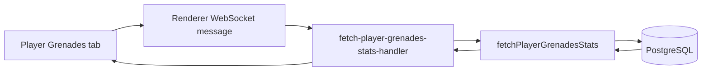

# Player Grenades Statistics Tab Plan

## Goal

Add a `Grenades` tab to the player profile page. The tab should show aggregated grenade statistics for the current
player across all matches included by the active player filters.

The first implementation should focus on useful cross-match averages:

- Average flashbangs, HE grenades, smokes, and fire grenades thrown per match.
- Average grenade throws per round.
- Flashbang impact: flashed enemies, blind duration, flashed enemies per throw, flashed enemies per match.
- HE impact: damage, damage per throw, damage per match, kills.
- Fire impact: damage, damage per throw, damage per match.
- Optional flashbang matchup table showing who this player flashes most often.

## Merge-Friendly Constraints

- Do not change the demo analyzer.
- Do not change the database schema.
- Do not refactor the existing match `Grenades` page.
- Do not add grenade data to the main `PlayerProfile` payload unless it becomes necessary.
- Prefer a new lazy-loaded player grenades endpoint so the existing player overview query stays stable.
- Keep new files under narrow feature folders:
  - `src/node/database/player/`
  - `src/server/handlers/renderer-process/player/`
  - `src/ui/player/grenades/`
  - `src/common/types/`

## Data Flow



## Data Sources

Use existing database tables only:

- `players`: match participation and player identity.
- `rounds`: round counts per filtered match.
- `shots`: grenade throws.
- `player_blinds`: flashbang impact.
- `damages`: HE and fire damage.
- `kills`: HE kills.
- `matches` and `demos`: required joins for `applyMatchFilters`.

All queries should reuse `applyMatchFilters` from `src/node/database/match/apply-match-filters.ts`.

## Proposed Types

Create `src/common/types/player-grenades-stats.ts`.

```ts
export type PlayerGrenadeSummary = {
  steamId: string;
  matchCount: number;
  roundCount: number;
  flashbangsThrownCount: number;
  heGrenadesThrownCount: number;
  smokeGrenadesThrownCount: number;
  fireGrenadesThrownCount: number;
  averageFlashbangsThrownPerMatch: number;
  averageHeGrenadesThrownPerMatch: number;
  averageSmokeGrenadesThrownPerMatch: number;
  averageFireGrenadesThrownPerMatch: number;
  averageFlashbangsThrownPerRound: number;
  averageHeGrenadesThrownPerRound: number;
  averageSmokeGrenadesThrownPerRound: number;
  averageFireGrenadesThrownPerRound: number;
  flashedEnemyCount: number;
  totalEnemyBlindDuration: number;
  averageEnemyBlindDuration: number;
  averageFlashedEnemiesPerFlashbang: number;
  averageFlashedEnemiesPerMatch: number;
  heDamage: number;
  averageHeDamagePerThrow: number;
  averageHeDamagePerMatch: number;
  heKillCount: number;
  fireDamage: number;
  averageFireDamagePerThrow: number;
  averageFireDamagePerMatch: number;
};

export type PlayerFlashbangMatchup = {
  flashedSteamId: string;
  flashedName: string;
  flashedCount: number;
  totalDuration: number;
  averageDuration: number;
};

export type PlayerGrenadesStats = {
  summary: PlayerGrenadeSummary;
  flashbangMatchups: PlayerFlashbangMatchup[];
};
```

The exact field names can be adjusted during implementation, but keep the payload compact and specific to this tab.

## Metric Definitions

Use these definitions for the first version:

- Match count: number of filtered matches where the player appears in `players`.
- Round count: rounds from filtered matches where the player appears.
- Grenade thrown count: rows in `shots` for the player and grenade weapon name, excluding bot-controlled throws.
- Fire grenades: `Molotov` plus `Incendiary`.
- Enemy flash count: rows in `player_blinds` where:
  - `flasher_steam_id` is the current player.
  - `flasher_side != flashed_side`.
  - `is_flasher_controlling_bot = false`.
- Enemy blind duration: sum/average of `player_blinds.duration` using the same enemy flash filter.
- HE damage: sum of `damages.health_damage` where:
  - `attacker_steam_id` is the current player.
  - `weapon_name` is HE.
  - `attacker_side != victim_side`.
  - `is_attacker_controlling_bot = false`.
- Fire damage: same as HE damage, but weapon is `Molotov` or `Incendiary`.
- HE kills: rows in `kills` where:
  - `killer_steam_id` is the current player.
  - weapon is HE.
  - `killer_side != victim_side`.
  - `is_killer_controlling_bot = false`.

For averages:

- `averageXPerMatch = totalX / matchCount`.
- `averageXPerRound = totalX / roundCount`.
- `averageDamagePerThrow = totalDamage / thrownCount`.
- `averageFlashedEnemiesPerFlashbang = flashedEnemyCount / flashbangsThrownCount`.

Use `0` when the denominator is `0`.

## Batch 1: Backend Query

Files:

- Add `src/common/types/player-grenades-stats.ts`.
- Add `src/node/database/player/fetch-player-grenades-stats.ts`.

Tasks:

- [ ] Define the `PlayerGrenadesStats` payload type.
- [ ] Implement `fetchPlayerGrenadesStats(steamId: string, filters: MatchFilters)`.
- [ ] Build a filtered matches/player CTE so every subquery shares the same filter scope.
- [ ] Aggregate match count and round count.
- [ ] Aggregate throws from `shots`.
- [ ] Aggregate flash impact from `player_blinds`.
- [ ] Aggregate HE/fire damage from `damages`.
- [ ] Aggregate HE kills from `kills`.
- [ ] Return a fully populated object with zeros for missing data.

Notes:

- Use Kysely and the style already used in `fetch-player-utility-stats.ts`.
- Keep the SQL readable even if it means several small queries in `Promise.all`.
- Avoid changing `fetchPlayerProfile` in this batch.

Validation:

- [ ] `vp run compile`
- [ ] `vp run lint`

Suggested commit:

`feat(player): add grenades stats query`

## Batch 2: WebSocket Handler

Files:

- Add `src/server/handlers/renderer-process/player/fetch-player-grenades-stats-handler.ts`.
- Update `src/server/renderer-client-message-name.ts`.
- Update `src/server/handlers/renderer-handlers-mapping.ts`.

Tasks:

- [ ] Add `FetchPlayerGrenadesStats: 'fetch-player-grenades-stats'`.
- [ ] Define handler payload as `MatchFilters & { steamId: string }`.
- [ ] Call `fetchPlayerGrenadesStats(payload.steamId, payload)`.
- [ ] Register handler type in `RendererMessageHandlers`.
- [ ] Register handler implementation in `rendererHandlers`.

Validation:

- [ ] `vp run compile`
- [ ] `vp run lint`

Suggested commit:

`feat(player): expose grenades stats endpoint`

## Batch 3: Player Grenades Route

Files:

- Add `src/ui/player/grenades/player-grenades.tsx`.
- Optionally add `src/ui/player/grenades/use-fetch-player-grenades-stats.ts`.
- Update `src/ui/routes-paths.ts`.
- Update `src/ui/router.tsx`.
- Update `src/ui/player/player-tabs.tsx`.

Tasks:

- [ ] Add `RoutePath.PlayerGrenades = 'grenades'`.
- [ ] Add the `Grenades` tab link in `PlayerTabs`.
- [ ] Add a player child route for `PlayerGrenades`.
- [ ] In `PlayerGrenades`, read the current player Steam ID and active player filters.
- [ ] Fetch stats lazily with `RendererClientMessageName.FetchPlayerGrenadesStats`.
- [ ] Show local loading, error, and empty states.

UI wording:

- Tab: `Grenades`
- Panel title: `Grenades`
- Empty state: `No grenade stats found for the current filters.`

Because this batch adds user-visible strings, run i18n extraction.

Validation:

- [ ] `vp run compile`
- [ ] `vp run lint`
- [ ] `vp run i18n:extract`

Suggested commit:

`feat(player): add grenades tab`

## Batch 4: UI Layout and Polish

Files:

- Add small components under `src/ui/player/grenades/`, for example:
  - `grenades-summary.tsx`
  - `grenades-table.tsx`
  - `flashbang-matchups.tsx`

Tasks:

- [ ] Add summary panels for the most important per-match averages.
- [ ] Add a compact table for grenade type rows.
- [ ] Add optional flashbang matchup table.
- [ ] Keep Tailwind classes to existing spacing/text/color tokens.
- [ ] Avoid arbitrary Tailwind values unless the existing component pattern already requires them.
- [ ] Add tooltips only for ambiguous metrics.

Suggested initial summary cards:

- Flashbangs / match
- Enemies flashed / match
- Avg blind time
- HE damage / match
- Fire damage / match
- Smokes / match

Suggested table rows:

- Flashbang
- HE
- Fire
- Smoke

Validation:

- [ ] `vp run compile`
- [ ] `vp run lint`
- [ ] `vp run i18n:extract`

Suggested commit:

`feat(player): display grenades stats`

## Batch 5: Full Validation and Package

Tasks:

- [ ] `vp run compile`
- [ ] `vp run lint`
- [ ] `vp run build`
- [ ] `vp run i18n:extract`
- [ ] Optional: `vp run package --dir`

Manual checks:

- [ ] Open a player with many matches.
- [ ] Verify the `Grenades` tab appears.
- [ ] Compare a known match's Grenades values against the player aggregate directionally.
- [ ] Change player filters and confirm stats refresh.
- [ ] Confirm empty/error states do not break the page.

Suggested final commit if batches were not committed separately:

`feat(player): add grenades statistics tab`

## Implementation Order Recommendation

1. Backend query first, because the metric definitions are the core risk.
2. Handler registration second, because it gives a typed boundary.
3. Route and minimal UI third, so the tab can be opened early.
4. Polish layout after the data is known to be correct.
5. Package a custom exe only after the feature is stable.

## Open Questions

- Should "average per game" mean per match or per round? The first version should show both, with labels `Avg / match`
  and `Avg / round`.
- Should flash assists be included as a separate metric? It can be added later from `kills.is_assisted_flash`.
- Should team flashes be shown? The first version should focus on enemy flashes, but the matchup table can add a
  teammate/enemy label later.
- Should 2v2/scrimmage matches be excluded like some current utility stats? The first version should respect active
  filters only; add game-mode-specific exclusions only if the displayed metric explicitly says so.
